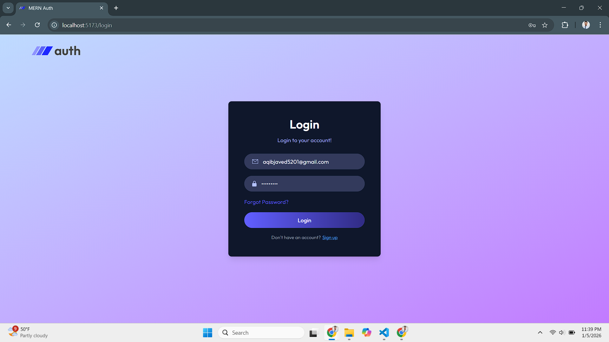
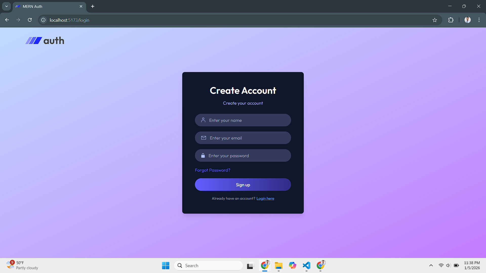
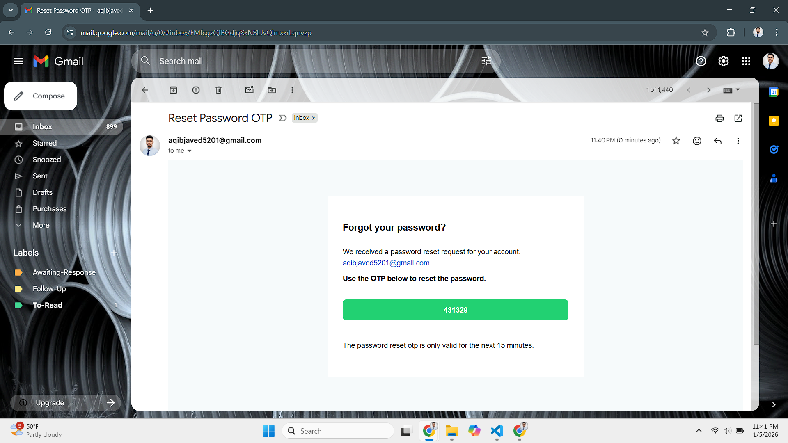
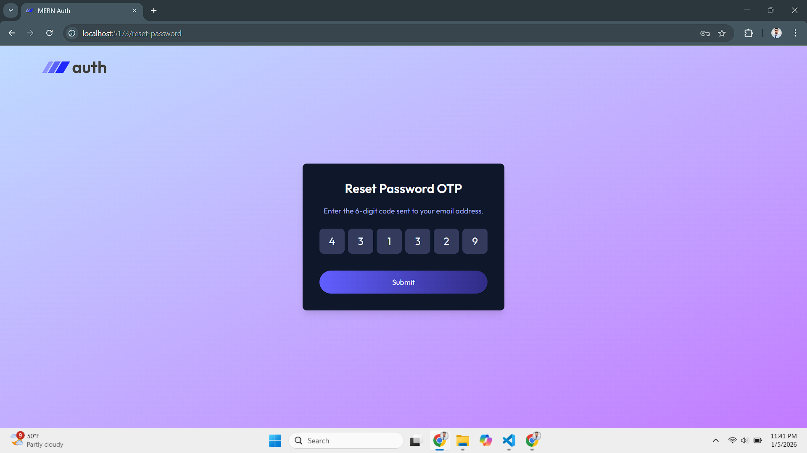
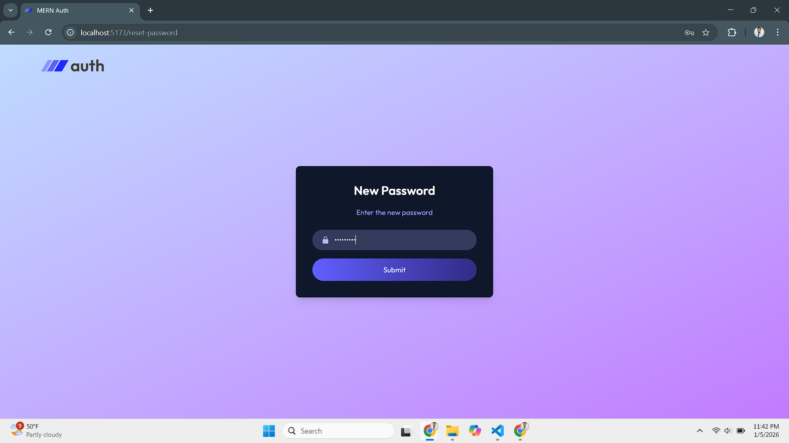
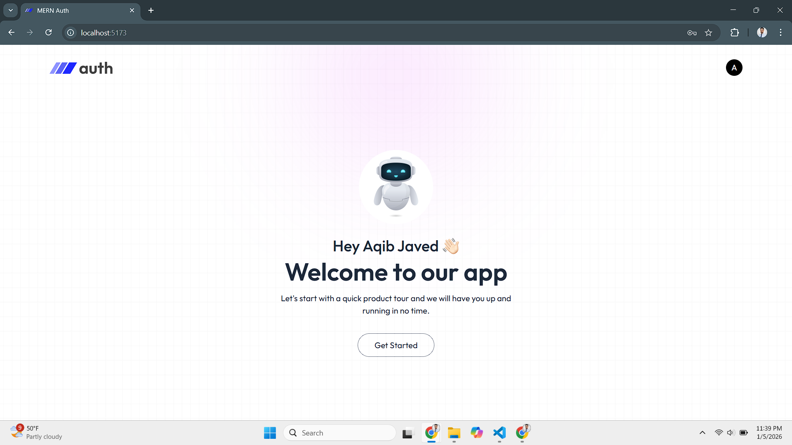

# 🔐 MERN Authentication System

A **full-stack MERN authentication application** implementing secure user registration, login, and **email-based OTP verification**.
This project demonstrates real-world authentication workflows commonly used in modern web applications.

🔗 **Repository:** [https://github.com/AqibNiazi/mern-auth](https://github.com/AqibNiazi/mern-auth)

---

## 🚀 Features

- 👤 **User Registration**

  - Create a new account using email and password

- 🔑 **User Login**

  - Secure authentication using JWT

- 📧 **Email Verification with OTP**

  - OTP sent to the registered email address
  - Account is activated only after successful OTP verification

- 🔐 **Protected Routes**

  - Only authenticated users can access protected APIs

- 🍪 **HTTP-Only Cookies**

  - Secure token storage

- 🛡️ **Password Hashing**

  - Passwords encrypted using bcrypt

- 🌐 **CORS-enabled Backend**

  - Supports deployed frontend applications

---

## 🧠 Authentication Flow

1. User registers with email & password
2. Account is created in an **unverified** state
3. OTP is sent to the user’s email
4. User submits OTP
5. Account status changes to **verified**
6. User can now log in and access protected routes

---

## 🛠️ Tech Stack

### Frontend

- React.js
- Tailwind CSS
- React Router Dom v7
- Toastify
- Axios
- Vite

### Backend

- Node.js
- Express.js
- MongoDB & Mongoose
- JWT (JSON Web Tokens)
- Nodemailer
- bcrypt / bcryptjs
- Cookie-Parser

### Deployment

- Frontend: **Vercel**
- Backend: **Vercel (Serverless Functions)**

---

## 📁 Project Structure

```
mern-auth/
│
├── client/                # React frontend
│
├── server/
│   ├── api/
│   │   └── index.js       # Serverless entry point
│   ├── src/
│   │   ├── config/        # Database configuration
│   │   ├── models/        # Mongoose schemas
│   │   ├── controllers/  # Business logic
│   │   ├── Router/        # API routes
│   │   └── utils/         # OTP & email utilities
│   ├── vercel.json
│   └── package.json


---

## 🖼️ Screenshots

> Add screenshots by uploading images to the `screenshots/` folder and linking them below.

```md
## 🖼️ Screenshots

### 🔐 Login Page



### 📝 Register Page



### 📧 Reset Password Flow







### 🏠 Dashboard / Protected Route




---

## ⚙️ Environment Variables

Create a `.env` file inside the **server** directory:

```env
MONGODB_URI=your_mongodb_connection_string
JWT_SECRET=your_jwt_secret

SMTP_HOST=smtp.gmail.com
SMTP_PORT=465
SMTP_SECURE=true
SMTP_USER=your_email@gmail.com
SMTP_PASS=your_app_password

NODE_ENV=development
```

⚠️ **Do not commit `.env` files to GitHub**

---

## ▶️ Running the Project Locally

### 1️⃣ Clone the Repository

```bash
git clone https://github.com/AqibNiazi/mern-auth.git
cd mern-auth
```

### 2️⃣ Backend Setup

```bash
cd server
npm install
npm run dev
```

Backend will run on:

```
http://localhost:3000
```

### 3️⃣ Frontend Setup

```bash
cd client
npm install
npm run dev
```

Frontend will run on:

```
http://localhost:5173
```

---

## 🔒 API Endpoints (Sample)

| Method | Endpoint               | Description            |
| ------ | ---------------------- | ---------------------- |
| POST   | `/api/auth/register`   | Register new user      |
| POST   | `/api/auth/login`      | Login user             |
| POST   | `/api/auth/verify-otp` | Verify account via OTP |
| GET    | `/api/user/profile`    | Protected user route   |


---

## 🙌 Author

**Muhammad Aqib Javed**
Aspiring Full-Stack & AI/ML Engineer

- GitHub: [AqibNiazi](https://github.com/AqibNiazi)

